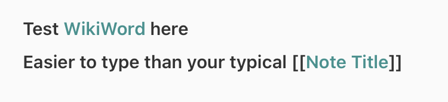

# NPThemes-WikiWords

## Overview
This is a custom theme for the awesome Mac and iOS app called "NotePlan" by Eduard Metzger.  The theme is based on the "Toothbleach" theme provided with NotePlan. 
It's only added feature is to "Wikify" any words that are in BumpyCase, in the style of the Wikis of pre-Markdown days.

                                                                                                
## Method
It turns out that any string matched by the designated regular expression assigned in the theme, can use that matched text as a note target.  THen, we simply send it through the NotePlan x-url-callback, which is the same mechanism that the primary [[Note]] links use.  The only difference is that these WikiWord notes will not show up as "backlinks" in the reference section of the target note.  

## Motivation
There are a couple of reasons why we might want to use WikiWords in addition to the existing [[link]] syntax:
- Legacy notes: A number of "seasoned" users like myself probably have a pile of old notes from those old Wiki systems (zim, Dokuwiki, Twiki, Tiddlywiki, WikidPad) and would like to import them into NotePlan
- Ease of use - especially on limited mobile keyboards, it is easier to type a WikiWord than to add [[brackets]]
- Compatibility - once the WikiWord is created, it creates a bona-fide note that is interoperable with [[WikiWord]]

## Demotivation - Why not?
- They do not trigger backlink references (presently).  Only [[WikiWord]] bracketed links do.
- Not part of Markdown Standard (phooey)
- They are not portable to Obsidian, Roam, other popular tools that NotePlan has some interoperability with
- False hits - there are times when you might not want some words to resolve as Wiki links.  E.g. some product names, etc 

## Suggestions?
This is still a work in progress - please close/branch/submit pull requests or issues, and I'l work to improve this as best as I can!

-Rob (Gracius on Discord)
